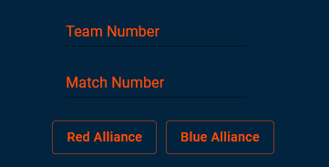

# GearScout: A Scouting Tool for FRC
### Developed by Team 2338: Gear It Forward

## What is GearScout?
GearScout is a web-based scouting tool that collects quantitative data on teams during events. The app can collect data during all portions of a match, including autonomous, teleoperated, and endgame. It is completely open and free to all FRC teams, so feel free to give it a try!

## What do I need to use it?
All you need is a device that can connect to the internet! A steady internet connection is **NOT** required to use the app, but it is needed to send data to the server. 

## How can I access GearScout? 
You can access GearScout from any device with [this link](https://gearitforward.com/).

## How do I use GearScout?

### Signing in
When you access GearScout, you will see a landing page with multiple fields for signing in. Enter your team number, event code, your name, and secret code in the text fields. Event and secret codes should be predetermined, and every scouter from the same team should use these codes. 

### Entering robot and match info
Once you log in, you will see more fields at the top of the screen. Enter the team number, match number, and the alliance the team is on.

### Entering Data
There are two sections in GearScout: Auto and Teleop (including Endgame).
 
In the Auto section, you can note whether the robot left the starting zone, and how many game pieces the robot scored in the Speaker and Amp (note that these counters cannot be below zero).

In the Teleop section, there are more counters for the Speaker and Amp, as well as a counter for the Trap (note that the Trap counter cannot go above 3). 
 
In the Stage section, click the button that corresponds to how many robots your robot hung with (for example, if the robot hung with one other robot on the same chain, you would select "Double Climb").

Note that counters should only display the number of game pieces a robot scores, not the number of points scored.
 
Also note that there is no option to record whether a robot is spotlit.
 
Once you are finished, hit Submit! 

